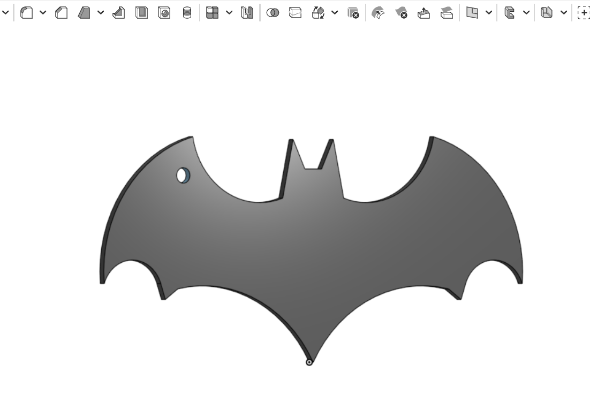

# Batman 3D Keychain

This project is a 3D Batman keychain designed using Onshape as part of the mechanical design task.

## Project Description

The Batman logo was created as a 2D sketch and converted into a 3D model.  
A circular hole was added so the design can be used as a keychain.

## Specifications

- Model thickness: 2 mm
- Keychain hole diameter: 4 mm
- Export format: STL
- Design software: Onshape

## Project Preview

## Project Files

- [Download the STL file](Batman-Keychain.stl)
- [Watch the 3D model demonstration](Batman-Keychain-Demo.mp4)

## Onshape Design

[View the Batman Keychain design on Onshape](https://cad.onshape.com/documents/bfe305e166a7a3b0a8f673d8/w/e8b840ad8fa7581cc3509411/e/f4b32c9350f3caffd00b5d2d?renderMode=0&uiState=6a5b78604db7cf1288f0b355)

## Tools Used

- [Onshape](https://www.onshape.com/)
- [GitHub](https://github.com/)

## Designer

Faisal Albeshri  
Smart Methods Training
